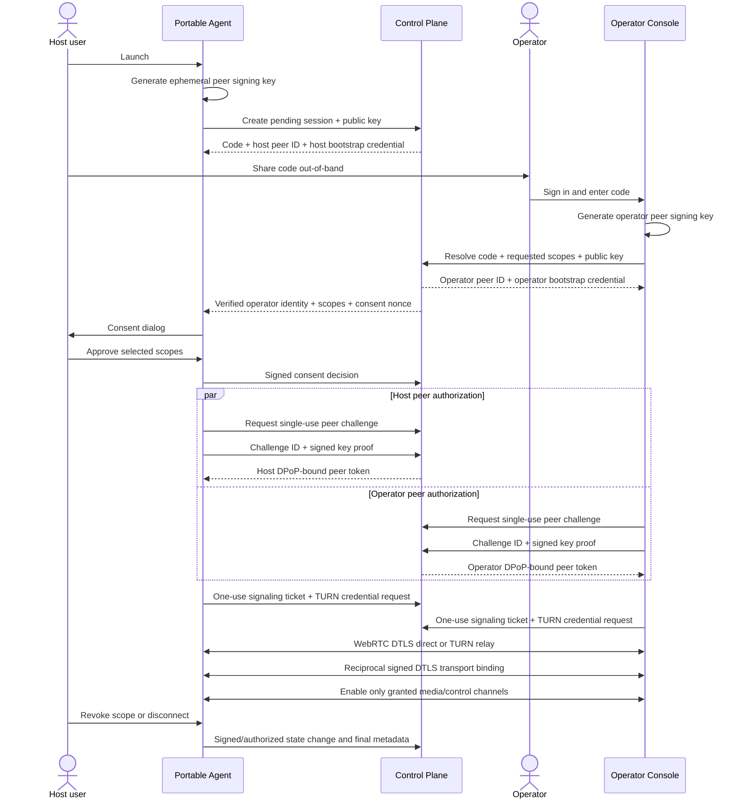
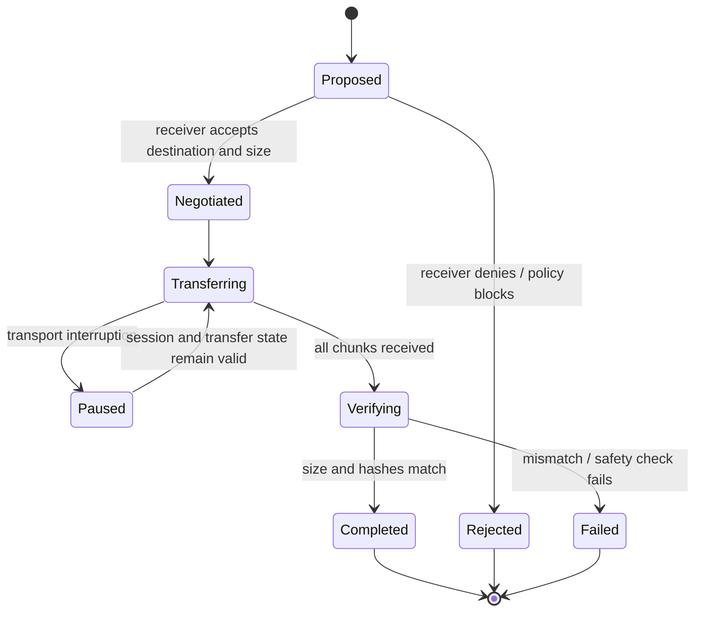

# User Flows

## 1. Attended session

The support code is a locator only. Consent, peer authorization, DPoP, TURN authorization and transport binding remain independent gates.

## 2. Managed attended session

1. Tenant admin creates a short-lived enrollment token and local admin installs the separately released Managed Host package.
2. The Service creates the device key, proves possession during enrollment and receives a renewable DPoP-bound device credential.
3. An authenticated operator requests `MANAGED_ATTENDED`; policy evaluation records an immutable decision and the session enters `HOST_PENDING`.
4. The installed Service receives the request through the authenticated bounded-long-poll channel.
5. The interactive Agent displays verified operator identity and requested scopes, generates a fresh host peer key and obtains local consent.
6. The active device key signs the host decision and binds the fresh host peer key.
7. Host and operator independently complete peer challenge/authorization, signaling/TURN issuance and reciprocal transport binding.
8. Device, membership or policy revocation invalidates credentials and terminates or blocks the session within the documented SLO.

## 3. Unattended session — separate release

The unattended flow starts only after Managed Host is approved. It additionally requires unattended enablement evidence, operator MFA/step-up, an unattended-specific policy decision and `UNATTENDED_SESSION` scope. The local host follows the configured notification/disclosure rule; hidden operation is not supported. It uses the same device-key decision, peer authorization, DPoP and transport-binding gates as managed attended support.

## 4. File transfer

## 5. Reboot continuity — Managed Host only

- Operator requests reboot; local consent/notification follows policy.
- The server issues a short-lived, single-use reboot reconnect grant bound to tenant, session, device, operator, authorization version and expected next epoch.
- The Service stores only a DPAPI machine-bound sealed continuity record; reusable peer/device access tokens and private peer keys are not persisted.
- Active inputs are released and the old transport/session epoch is closed cleanly before reboot.
- After boot and an eligible interactive session, the Service launches the Agent, consumes the grant, creates fresh peer key material and repeats authorization and transport binding.
- Expiry, reuse, revocation, unexpected boot state or policy change fails closed.
- No logon-screen or secure-desktop control is claimed without a separately proven compatibility and security contract.
