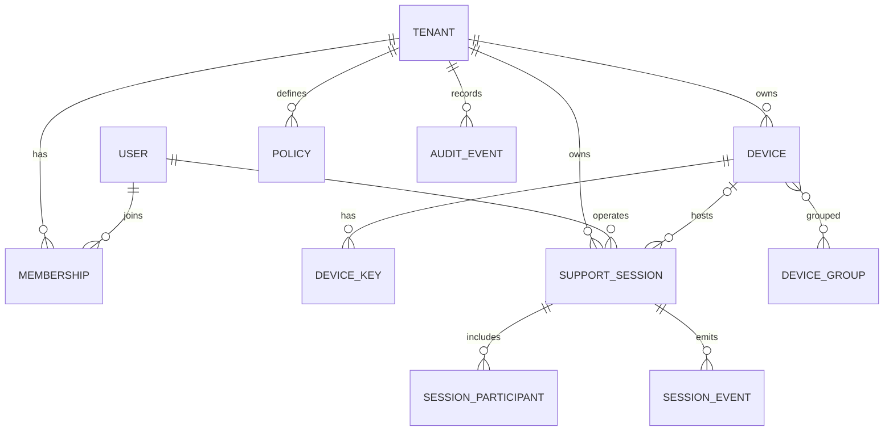

# Data Architecture

## 1. Principles

- PostgreSQL is the system of record.
- Every tenant-owned row includes `tenant_id`.
- Repository/query APIs require tenant context explicitly.
- Content data does not enter the database.
- Audit and metering events use immutable IDs and idempotency keys.
- Soft deletion is not a substitute for legal deletion; deletion workflows are explicit.

## 2. Core entities

## 3. Sensitive fields

| Field | Protection |
|---|---|
| operator email/name | application authorization, DB encryption-at-rest, retention policy |
| device public key | integrity critical, not secret |
| device private key | never in control-plane DB |
| enrollment token | hash only, short expiry, single use |
| session code | hash or keyed lookup representation, short expiry |
| refresh token | hashed/rotated or delegated to identity provider |
| IP address | restricted metadata, retention-limited |
| audit details | structured allowlist, no arbitrary sensitive text |

## 4. Transactional outbox

Administrative and security actions write domain state and an outbox record in the same database transaction. A dispatcher publishes to audit/notification/metering sinks. Consumers use event IDs for idempotency.

## 5. Retention

Retention is policy-driven by data class. A scheduled deletion service:

- selects expired rows in bounded batches;
- writes deletion audit evidence without retaining deleted payload;
- handles legal holds separately;
- supports tenant offboarding and account deletion;
- verifies object storage and backup lifecycle alignment.

## 6. Backup

- encrypted automated backups;
- point-in-time recovery;
- restore drills at least quarterly before mature GA;
- separate credential and access domain from production application;
- documented RPO/RTO targets in operations plan.

## Governance workflow data

Invitation tokens, support codes, enrollment tokens, bootstrap credentials, challenges and one-time grants are stored only as keyed/cryptographic lookup digests with expiry and consumption state. Data-export objects are encrypted, short-lived and referenced by opaque object keys; their inventories and hashes are retained according to audit policy. Tenant closure is an asynchronous state machine and never performs irreversible deletion in the request transaction. Legal holds are checked before deletion/anonymization jobs.

## Cryptographic metadata retention

The control plane may retain peer/device key thumbprints, transport-binding verification outcome, DTLS fingerprint hashes, authorization-context hash, epoch and permission revision for security evidence. It does not retain private keys, DPoP proof JWTs, proof signatures, SDP bodies, TURN credentials or remote-session content.
