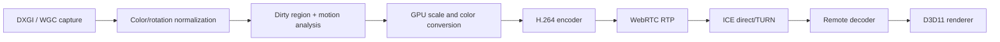

# Media Pipeline

## 1. Pipeline



## 2. Capture abstraction

```text
ICaptureSource
  Start(CaptureTarget, CaptureOptions)
  TryAcquireFrame(timeout)
  Reconfigure(target/options)
  Stop()

Implementations:
  DxgiDesktopDuplicationCapture
  WindowsGraphicsCaptureSource
  GdiCompatibilityCapture (limited fallback)
```

### Selection policy

- Full desktop/monitor: DXGI Desktop Duplication primary.
- User-selected window/display: Windows.Graphics.Capture.
- Fallback: GDI only for diagnosed compatibility failures, with quality warning.

## 3. Frame representation

```text
CapturedFrame
- frameId: uint64
- monotonicTimestampNs: uint64
- displayId: stable local identifier
- width/height/rotation
- pixelFormat
- hdrMetadata?
- dirtyRects[]
- moveRects[]
- cursorState
- gpuTextureHandle or CPU buffer
```

Ownership must be explicit. GPU textures use pooled lifetime with fences; CPU buffers use bounded pools. No unbounded frame queue is allowed.

## 4. Encoder strategy

- H.264 is initial mandatory codec.
- Prefer hardware Media Foundation encoder when available and stable.
- Provide software fallback for compatibility.
- Encode low-latency, no B-frames unless measurements prove safe.
- Keyframe on session start, monitor switch, decoder request and major format change.
- Support dynamic resolution, frame rate and bitrate changes.
- Maintain separate profiles:
  - `TEXT`: lower frame rate, sharper scale, lower quantization around text.
  - `BALANCED`: default.
  - `MOTION`: higher frame rate, adaptive scale.

## 5. Congestion adaptation

Inputs:

- WebRTC estimated available bitrate;
- packet loss, RTT and jitter;
- encoder queue depth;
- capture-to-send latency;
- CPU/GPU utilization;
- dirty-area ratio and motion score.

Outputs:

- target bitrate;
- max frame rate;
- output resolution scale;
- keyframe cadence;
- optional temporary grayscale/low-detail emergency mode.

Never queue old frames to “catch up.” Drop superseded frames and prioritize low latency.

## 6. HDR and color

- Detect source color space and HDR state.
- Initial GA may tone-map HDR to SDR for predictable remote display.
- Record the conversion path in telemetry.
- Native HDR end-to-end is a later capability and requires decoder/render compatibility matrix.

## 7. Cursor

Transmit cursor separately from video when possible:

- shape ID/cache;
- hotspot;
- visibility;
- position in canonical desktop coordinates.

This reduces perceived latency and avoids repeated cursor encoding.

## 8. Renderer

- D3D11 swap chain hosted in WPF through an interop surface or dedicated HWND.
- Render video and cursor separately.
- Support fit, 1:1, stretch and pan/zoom.
- Convert operator pointer coordinates back through the exact render transform.
