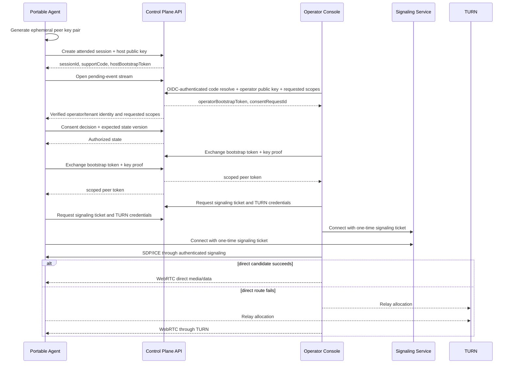
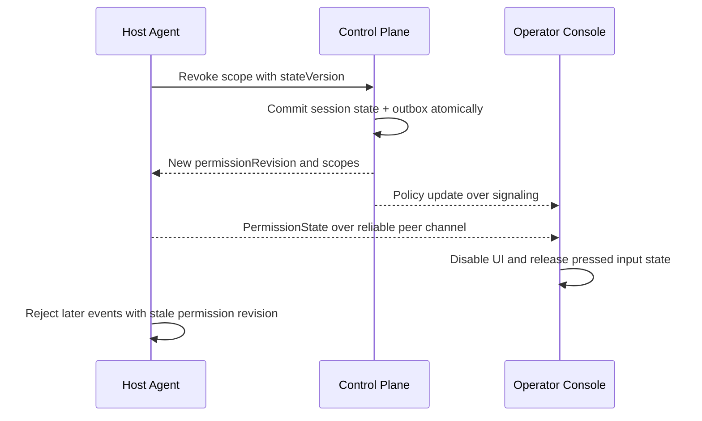
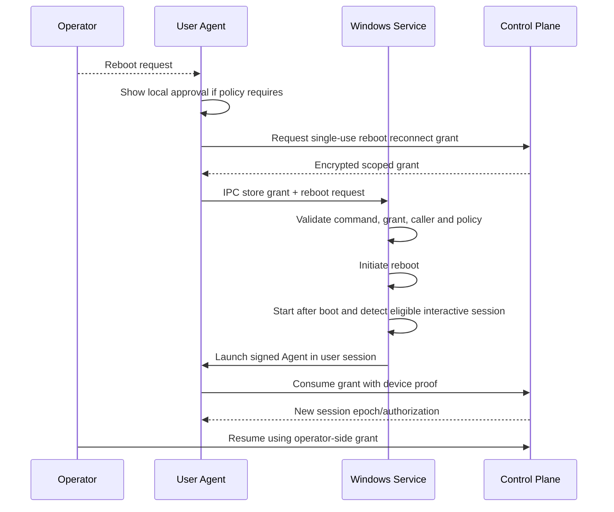

# Runtime Sequences

## 1. Attended session

### Invariants

- Support code lookup does not authenticate either peer.
- Bootstrap credentials cannot access media or TURN and expire quickly.
- Peer tokens are issued only after authorization and proof of possession.
- Signaling tickets are single-use and bound to session, peer, role, epoch, and key thumbprint.
- Consent may grant a strict subset of requested scopes.

## 2. Scope revocation

The host enforces revocation locally even if the signaling notification is delayed. The server enforces it for subsequent grants and reconnects.

## 3. Transport reconnect

1. Peer detects transport failure using WebRTC state and heartbeat deadlines.
2. Peer requests a reconnect grant with current peer token, prior epoch, and last permission revision.
3. Server rejects if session, identity, policy, or scopes are no longer valid.
4. Server increments epoch using compare-and-swap and returns a one-time grant.
5. Both peers obtain new signaling tickets; old epoch signaling is rejected.
6. Host releases remotely pressed keys/buttons before accepting new input.
7. File transfers reconcile verified chunk ranges before resuming.

## 4. Reboot continuity

A reboot grant cannot create a different session, change scopes, change operator, or survive its expiry.

## 5. Managed unattended session

- Operator must have an OIDC session with required MFA/step-up claims.
- Policy evaluation returns allowed scopes, duration, notification, local-consent, and schedule decisions.
- Device must be active, enrolled, healthy, and within the accepted minimum version.
- Device proves possession of the current device key.
- Service launches the interactive Agent visibly; session indicators remain active.
- Revocation of tenant, membership, device, key, or policy prevents new authorization and terminates active access within the configured revocation SLO.

## Managed-host sequence

Operator request -> policy decision -> `HOST_PENDING` -> transactional outbox -> authenticated device poll -> local consent/notification -> fresh host ephemeral key -> signed managed-host decision -> host/operator peer authorization -> signaling/TURN -> reciprocal signed transport binding -> content enabled.
