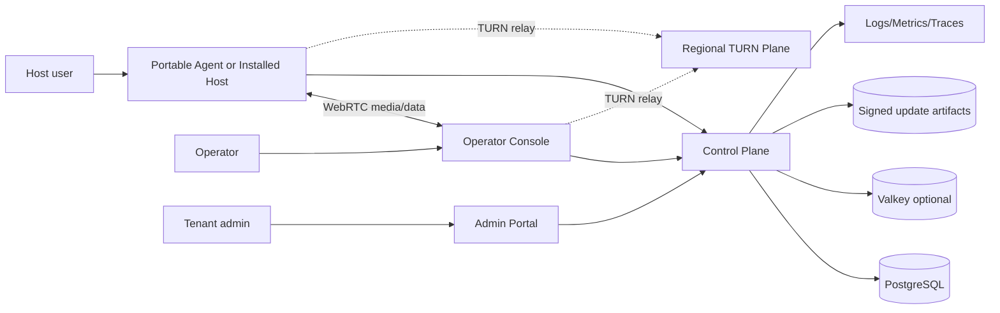

# System Architecture

## 1. Context

## 2. Trust zones

1. **Endpoint zone** — untrusted user devices, potentially compromised.
2. **Internet edge** — API gateway, rate limits, WAF where useful.
3. **Control plane** — identity, tenant, session orchestration, policy and audit.
4. **Relay plane** — high-bandwidth packet relay; no application-content persistence.
5. **Data zone** — databases, secrets and signing metadata.
6. **Build/release zone** — CI workers, code signing and artifact publication.
7. **Operations zone** — restricted admin and incident-response access.

## 3. Control plane modules

Start as a modular monolith to reduce operational complexity. Enforce module boundaries in code and database ownership. Extract only when scaling or independent release requirements justify it.

| Module | Responsibility |
|---|---|
| Identity | OIDC integration, sessions, MFA claims, API tokens |
| Tenant | organizations, memberships, roles and plans |
| Device | enrollment, keys, health, groups, revocation |
| Support Session | code issuance, consent, state and peer coordination |
| Signaling | authenticated SDP/ICE message relay and reconnect |
| Policy | capability and access decisions |
| TURN Credential | short-lived relay credentials and region selection |
| Audit | append-only security and administrative events |
| Update | release channels, signed manifest distribution |
| Metering | relay bytes, session duration and product entitlements |
| Notification | email/webhook/security alerts |
| Abuse | rate limits, reputation, suspension and review cases |

## 4. Data plane principle

The control plane must not proxy screen frames, input events, clipboard content or files. Peer traffic uses WebRTC direct connection or TURN relay. TURN observes transport metadata and encrypted packet flow but must not receive application decryption keys.

## 5. Failure isolation

- API failure should not immediately terminate an already established peer session.
- Signaling reconnect is independent from media transport when possible.
- TURN nodes are stateless except allocations and ephemeral auth state.
- Update service failure must not prevent normal session operation.
- Audit ingestion uses durable local buffering or transactional outbox; loss of audit evidence is release-blocking for privileged actions.

## 6. Deployment topology

### Initial commercial region

- 2 API instances behind a load balancer.
- Managed PostgreSQL with backups and point-in-time recovery.
- Optional Valkey for distributed locks, rate buckets and ephemeral presence.
- 2 or more TURN nodes with public IPs and independent failure domains.
- Object storage/CDN for signed installers and updates.
- Central metrics/logs/traces with security access controls.

### Scale-out

- Add TURN nodes by measured relay concurrency and egress.
- Separate signaling from REST only after connection count or release cadence requires it.
- Partition audit/metering pipelines after database load evidence.
- Introduce regional control planes only when latency, residency or resilience requirements justify the cost.

## Administration surface

The Admin Portal is an ASP.NET Core Blazor BFF with server-side OIDC and generated OpenAPI clients. It never connects directly to PostgreSQL and does not retain API bearer tokens in browser storage. See `../03-client/admin-portal.md`.
