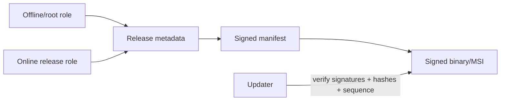

# Installer and Updater

## Product packages

1. **Portable attended agent** — signed executable/package, no service.
2. **Operator console installer** — per-user or per-machine according to enterprise need.
3. **Managed host installer** — per-machine MSI/bootstrapper, service and Agent.

## Installer requirements

- publisher code signature and timestamp;
- predictable install path under Program Files;
- restrictive ACLs;
- service registration with least privilege configuration;
- upgrade and repair support;
- clean uninstall and optional device unenrollment;
- no browser extension, driver or scheduled task unless explicitly justified;
- installer log redacts enrollment secrets.

## Update trust model

Minimum checks:

- HTTPS transport;
- metadata signature threshold;
- product/channel/architecture match;
- artifact SHA-256;
- Authenticode publisher signature;
- version and monotonically increasing release sequence;
- minimum allowed version;
- expiry of metadata;
- staged rollout eligibility;
- final health check and rollback to previously verified version when safe.

## Rollout

- internal;
- canary tenants/devices;
- 5%;
- 25%;
- 100%.

Promotion requires crash, connection and update-success metrics. Security hotfixes can accelerate but still require signature and compatibility gates.

## Key management

- build system does not possess offline/root key.
- production signing uses managed or hardware-protected key material.
- signing operations are audited.
- emergency key rotation and revocation are documented.
- Smart App Control compatibility requires an appropriate trusted RSA code-signing path as currently documented by Microsoft.

## Trust root and canonical input

The updater embeds the approved update root, validates root/targets thresholds, and applies root rotation only when both old and proposed root thresholds sign the new root. Manifest signatures cover RFC 8785 canonical JSON with the domain separator defined in `../02-protocol/canonicalization-and-signatures.md`. Delta packages are outside the v1 baseline.

## Root retrieval

The client calls `/updates/root` before accepting a manifest when the server advertises a newer root version. Root updates are sequential, expiry-checked and threshold-verified under both old and proposed root roles; skipped or rolled-back root versions are rejected unless the recovery procedure is invoked with separately approved offline evidence.
