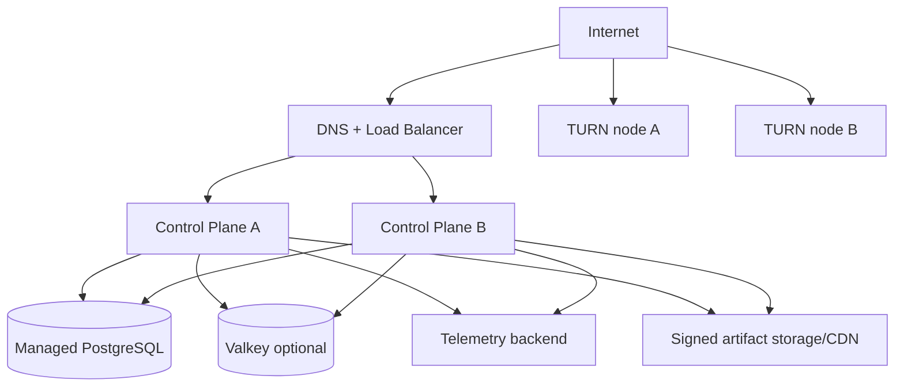

# Deployment Topology

## 1. Initial production

## 2. Network segmentation

- Public: load balancer and TURN listeners only.
- Application: control-plane containers.
- Data: PostgreSQL/Valkey private endpoints.
- Management: metrics, admin, backup and deployment access.
- Build/sign: separate from production runtime.

TURN relay traffic must not reach data or management networks.

## 3. Secrets

- Managed secret store or equivalent.
- Short-lived workload identity preferred over static cloud credentials.
- Separate TURN credential secret per environment/region.
- Database credentials rotated and scoped.
- Code-signing keys never placed in application secret store.

## 4. Environments

- local development;
- integration;
- security/compatibility lab;
- staging with production-like TURN;
- production.

No production customer data is copied to non-production.

## 5. Disaster recovery

- Database PITR and cross-zone resilience.
- Artifact manifests replicated and immutable.
- TURN nodes replaceable from image/config.
- DNS/LB failover procedure.
- Defined RPO/RTO measured through restore drills.
